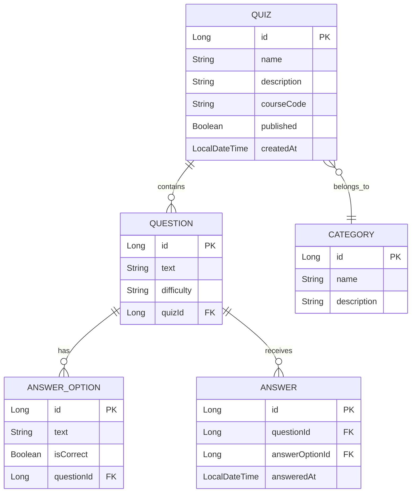

# Project Name

> Brief one-line description of your project

## Table of Contents

- [Description](#description)
- [Team Members](#team-members)
- [Technologies](#technologies)
- [Getting Started](#getting-started)
- [Project Management](#project-management)
- [Data Model](#data-model)
- [REST API Documentation](#rest-api-documentation)
- [Deployment](#deployment)
- [License](#license)

---

## Description

[Provide a detailed description of your project. What problem does it solve? Who is it for? What are the main features?]

### Features

- Feature 1
- Feature 2
- Feature 3

---

## Team Members

| Name | GitHub | Role |
|------|--------|------|
| [Name 1](https://github.com/username1) | @username1 | Scrum Master (Sprint 1) |
| [Name 2](https://github.com/username2) | @username2 | Developer |
| [Name 3](https://github.com/username3) | @username3 | Developer |
| [Name 4](https://github.com/username4) | @username4 | Developer |

---

## Technologies

### Backend
- **Language:** Java 21
- **Framework:** Spring Boot 3.x
- **Database:** H2 (development), PostgreSQL (production)
- **Build Tool:** Maven

### Frontend
- **Language:** JavaScript
- **Framework:** React 18
- **Build Tool:** Vite
- **Styling:** [CSS/Tailwind/Bootstrap]

---

## Getting Started

### Prerequisites

- Java 21 or higher
- Node.js 18 or higher
- Maven
- Git

### Backend Setup

1. Clone the repository:
   ```bash
   git clone https://github.com/your-org/your-repo.git
   cd your-repo
   ```

2. Run the backend:
   ```bash
   ./mvnw spring-boot:run
   ```

3. Access the application at `http://localhost:8080`

### Frontend Setup

1. Navigate to the frontend folder:
   ```bash
   cd frontend
   ```

2. Install dependencies:
   ```bash
   npm install
   ```

3. Run the development server:
   ```bash
   npm run dev
   ```

4. Access the frontend at `http://localhost:5173`

### Running Tests

```bash
# Backend tests
./mvnw test

# Frontend tests
cd frontend && npm test
```

---

## Project Management

- **Project Board:** [GitHub Projects](https://github.com/your-org/your-repo/projects/1)
- **Current Sprint:** [Sprint X Milestone](https://github.com/your-org/your-repo/milestone/X)

### Retrospectives

- [Sprint 1 Retrospective](https://edu.flinga.fi/s/BOARD_ID_1)
- [Sprint 2 Retrospective](https://edu.flinga.fi/s/BOARD_ID_2)

---

## Data Model



### Entities Description

| Entity | Description |
|--------|-------------|
| **Quiz** | Represents a quiz with name, description, and course code |
| **Category** | Categories for organizing quizzes |
| **Question** | Quiz questions with difficulty levels |
| **AnswerOption** | Multiple choice options for questions |
| **Answer** | Student answer submissions |

---

## REST API Documentation

- **Swagger UI:** [http://localhost:8080/swagger-ui/index.html](http://localhost:8080/swagger-ui/index.html)
- **Production:** [https://your-app.rahtiapp.fi/swagger-ui/index.html](https://your-app.rahtiapp.fi/swagger-ui/index.html)

### Main Endpoints

| Method | Endpoint | Description |
|--------|----------|-------------|
| GET | `/api/quizzes` | Get all published quizzes |
| GET | `/api/quizzes/{id}` | Get quiz by ID |
| POST | `/api/quizzes` | Create a new quiz |
| PUT | `/api/quizzes/{id}` | Update a quiz |
| DELETE | `/api/quizzes/{id}` | Delete a quiz |
| GET | `/api/quizzes/{id}/questions` | Get quiz questions |
| POST | `/api/answers` | Submit an answer |

---

## Deployment

### Production URLs

- **Backend:** [https://your-backend.rahtiapp.fi](https://your-backend.rahtiapp.fi)
- **Frontend:** [https://your-frontend.onrender.com](https://your-frontend.onrender.com)

### Deployment Instructions

See deployment guides:
- [Backend Deployment Guide](link-to-backend-deployment)
- [Frontend Deployment Guide](link-to-frontend-deployment)

---

## License

This project is licensed under the MIT License - see the [LICENSE](LICENSE) file for details.

---

## Acknowledgments

- CS2113 Software Development Project Course
- School of Computing Communication and Media Studies
- [Any other acknowledgments]
